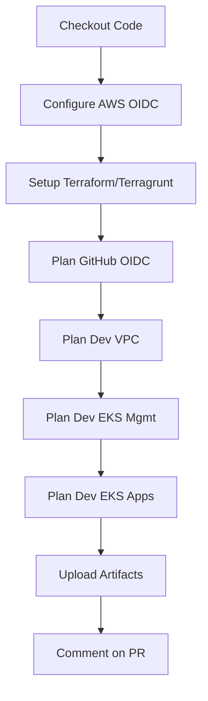
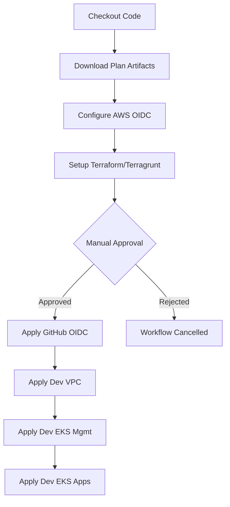

# CI/CD Setup for Infrastructure

This document describes the GitHub Actions CI/CD pipeline for managing infrastructure.

## Overview

The workflow automates Terraform deployments using:
- **GitHub OIDC** for secure AWS authentication (no static credentials)
- **Terragrunt** for DRY infrastructure code
- **Plan on PR** → **Apply on merge to main** pattern
- **Manual approval** via GitHub Environments for production changes

## Workflow File

`.github/workflows/terraform.yml`

## Deployment Stacks

The CI/CD pipeline manages the following stacks in order:

1. **Organizations** (manual deployment only - requires admin credentials)
2. **GitHub OIDC** (`environments/aws/root/deployment/github-oidc`)
3. **Dev VPC** (`environments/aws/dev/vpc`)
4. **Dev EKS Management** (`environments/aws/dev/eks-mgmt`)
5. **Dev EKS Apps** (`environments/aws/dev/eks-apps`)

## Workflow Triggers

### Pull Requests to `main`

```yaml
on:
  pull_request:
    branches: [main]
    paths:
      - 'modules/**'
      - 'environments/**'
      - 'root.hcl'
      - '.github/workflows/terraform.yml'
```

**Actions:**
- ✅ Run `terragrunt plan` for all stacks
- ✅ Upload plan artifacts
- ✅ Comment on PR with plan details
- ❌ No infrastructure changes applied

### Push to `main` (merged PR)

```yaml
on:
  push:
    branches: [main]
    paths:
      - 'modules/**'
      - 'environments/**'
      - 'root.hcl'
```

**Actions:**
- ✅ Download plan artifacts from PR
- ✅ Run `terragrunt apply` with plan files
- ✅ Apply changes to AWS infrastructure
- ⚠️ Requires manual approval (GitHub Environment: `production`)

## Required Secrets

Configure these in GitHub repository settings (`Settings` → `Secrets and variables` → `Actions`):

| Secret Name | Description | Example |
|-------------|-------------|---------|
| `DEV_ACCOUNT_EMAIL` | Email for AWS Organizations dev account | `dev-aws@example.com` |

## Required Environment

Configure in GitHub repository settings (`Settings` → `Environments`):

### Environment: `production`

**Protection rules:**
- ✅ Required reviewers (at least 1)
- ✅ Wait timer (optional, e.g., 5 minutes)

This ensures human approval before applying infrastructure changes.

## IAM Role Permissions

The `GitHubActionsDeploymentRole` must have permissions for:

- **VPC**: `ec2:*` (VPC, subnets, NAT, IGW, route tables, security groups)
- **ELB**: `elasticloadbalancing:*` (ALB, target groups, listeners)
- **EKS**: `eks:*` (clusters, Fargate profiles)
- **IAM**: Limited permissions (roles, policies for EKS, ALB controller)
- **Logs**: `logs:CreateLogGroup`, `logs:PutRetentionPolicy` (if cluster logging enabled)

The role is restricted by the `GitHubActionsPermissionsBoundary` for defense-in-depth.

## Workflow Steps

### Plan Job (Pull Requests)



**Output:** PR comment with collapsible plan details for each stack.

### Apply Job (Main Branch)



**Important:** Stacks are applied **sequentially** to respect dependencies:
- VPC must exist before EKS clusters
- EKS management cluster before apps cluster (optional, but logical)

## Dependency Management

Terragrunt handles dependencies automatically via `dependency` blocks:

```hcl
# environments/aws/dev/eks-mgmt/terragrunt.hcl
dependency "vpc" {
  config_path = "../vpc"
}

inputs = {
  vpc_id     = dependency.vpc.outputs.vpc_id
  subnet_ids = dependency.vpc.outputs.private_subnet_list
  # ...
}
```

When planning, Terragrunt will:
1. Check if VPC outputs exist
2. If not, use mock outputs (if configured) or fail
3. When applying, ensure VPC is already deployed

## PR Workflow Example

### 1. Create Feature Branch

```bash
git checkout -b feature/add-new-cluster
```

### 2. Make Infrastructure Changes

```bash
# Edit files
vim environments/aws/dev/eks-apps/terragrunt.hcl

# Commit
git add .
git commit -m "feat: increase Fargate namespaces for apps cluster"
```

### 3. Push and Create PR

```bash
git push origin feature/add-new-cluster
# Create PR on GitHub
```

### 4. Automated Plan

- Workflow triggers on PR
- Plans are generated for all stacks
- Bot comments on PR with plan details

### 5. Review Plans

- Reviewers check the plan output
- Verify no unexpected changes
- Approve PR if acceptable

### 6. Merge PR

```bash
# Merge via GitHub UI or CLI
gh pr merge --squash
```

### 7. Manual Approval

- Apply job starts
- Waits for approval in GitHub Environments
- Reviewer clicks "Approve and deploy"

### 8. Automated Apply

- Infrastructure changes are applied
- Stacks are updated in order
- Workflow completes

## Local Development vs CI/CD

### Local Development (recommended for testing)

```bash
# Plan locally
cd environments/aws/dev/vpc
terragrunt plan

# Apply locally (if authorized)
terragrunt apply
```

**Advantages:**
- Faster feedback loop
- No PR required for testing
- Can test with mock data

### CI/CD (recommended for production)

**Advantages:**
- Audit trail (all changes via Git)
- Peer review via PR process
- Prevents accidental changes
- Consistent environment (GitHub runners)

## Troubleshooting

### Plan fails with "Error: NoSuchEntity"

**Cause:** OIDC role or permissions boundary doesn't exist yet.

**Solution:**
1. Deploy Organizations stack manually first
2. Deploy GitHub OIDC stack manually
3. Then use CI/CD for subsequent changes

### Apply fails with "AccessDenied"

**Cause:** IAM role lacks necessary permissions.

**Solution:**
1. Check `modules/aws/github-oidc/main.tf` for role policy
2. Add missing permissions to inline policy
3. Apply github-oidc stack manually or via CI/CD

### Plan artifacts not found during apply

**Cause:** Plan and apply ran in different GitHub Action runs.

**Solution:**
- Plans are only valid for the same commit SHA
- Re-run the workflow or create a new PR

### Dependency outputs not available

**Cause:** VPC hasn't been deployed yet.

**Solution:**
1. Deploy VPC first: `cd environments/aws/dev/vpc && terragrunt apply`
2. Then deploy EKS clusters

**Alternative:** Add mock outputs to dependency blocks for planning without dependencies.

## Best Practices

1. **Always plan before apply**
   - Never merge without reviewing the plan comment
   - Check for unexpected resource deletions

2. **Use feature branches**
   - Create a branch for each infrastructure change
   - Squash commits when merging

3. **Keep PRs focused**
   - One logical change per PR
   - Easier to review and rollback

4. **Tag releases**
   - Tag main after successful deploys
   - Use semantic versioning (e.g., `v1.2.0`)

5. **Document breaking changes**
   - Call out resource replacements in PR description
   - Coordinate downtime if necessary

6. **Test locally first**
   - Validate Terraform syntax: `terraform validate`
   - Run plan locally before pushing

7. **Monitor apply logs**
   - Watch the GitHub Actions logs during apply
   - Verify resources are created correctly

## Security Considerations

✅ **OIDC authentication** - No long-lived AWS credentials in GitHub
✅ **Permissions boundary** - Limits what the role can do
✅ **Manual approval** - Human oversight before changes
✅ **Audit trail** - All changes tracked in Git history
✅ **Read-only plans** - PRs cannot modify infrastructure
⚠️ **Plan artifacts** - Contain sensitive data, auto-deleted after 7 days

## Adding New Stacks

To add a new stack to CI/CD:

1. **Create the stack directory**
   ```bash
   mkdir -p environments/aws/dev/new-stack
   ```

2. **Add terragrunt.hcl**
   ```hcl
   include "root" {
     path = find_in_parent_folders("root.hcl")
   }

   terraform {
     source = "../../../../modules/aws/new-module"
   }

   inputs = {
     # ...
   }
   ```

3. **Update workflow**
   - Add plan step in `terraform-plan` job
   - Add apply step in `terraform-apply` job
   - Add to artifact paths
   - Add to PR comment script

4. **Test**
   - Create PR with the new stack
   - Verify plan runs successfully
   - Merge and apply

## Rollback Procedure

### Option 1: Git Revert

```bash
# Revert the merge commit
git revert -m 1 <merge-commit-sha>
git push origin main
```

This creates a new commit that undoes the changes and triggers CI/CD to apply the rollback.

### Option 2: Manual Terraform Rollback

```bash
# Checkout the previous good commit
git checkout <previous-commit>

# Apply manually
cd environments/aws/dev/<stack>
terragrunt apply
```

### Option 3: Resource Recovery

If resources were deleted accidentally:

```bash
# Import existing resources
terragrunt import <resource-type>.<name> <aws-resource-id>

# Re-apply
terragrunt apply
```

## Cost Monitoring

The CI/CD workflow doesn't include cost estimation yet. Consider adding:

- **Infracost**: Automated cost estimates in PR comments
- **AWS Cost Explorer**: Monitor actual spend
- **Budget alerts**: SNS notifications when thresholds exceeded

Example Infracost integration:

```yaml
- name: Setup Infracost
  uses: infracost/actions/setup@v2
  with:
    api-key: ${{ secrets.INFRACOST_API_KEY }}

- name: Generate cost estimate
  run: |
    infracost breakdown --path=environments/aws/dev
```

## Future Enhancements

- [ ] Add Terraform drift detection (scheduled workflow)
- [ ] Implement Terragrunt run-all for parallel deploys
- [ ] Add automated testing (Terratest)
- [ ] Integrate Infracost for cost estimation
- [ ] Add Slack/Teams notifications for apply results
- [ ] Implement blue/green deployments for EKS clusters
- [ ] Add automated backup verification
- [ ] Implement disaster recovery runbooks
